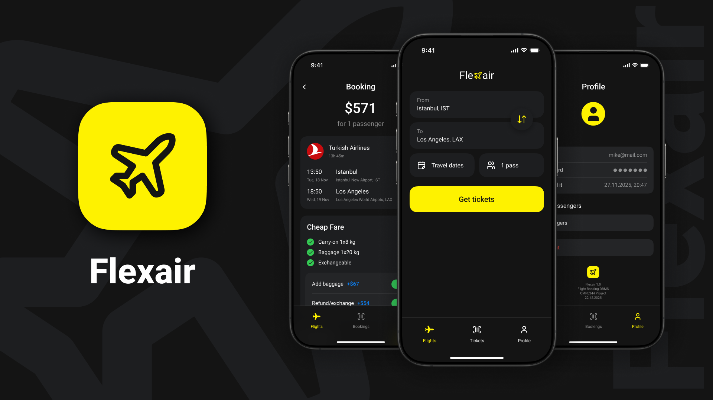
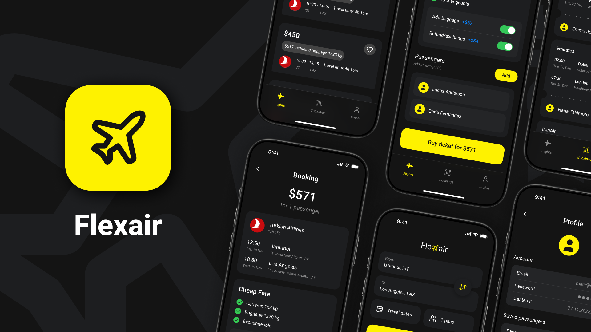

# ✈️ FlexAir - Flight Booking System

Flight Booking & Management System powered by Supabase (Backend as a Service) and PostgreSQL, including an iOS Mobile Application for Customers and a Web-based Dashboard for Admins.



## 📋 Project Information

- **Course**: CMPE344 - Database Management Systems and Programming II
- **Institution**: Cyprus International University
- **Instructor**: Prof Dr Melike Şah Direkoğlu
- **Due Date**: December 21, 2025

## 👥 Team Members

- Mahan Mizani
- Nikolai Piatnov
- Maksim Kalmykov
- Marcel Tshidibi Ngoyi

## 🎯 Features

- Flight search by route and date
- Passenger management
- Booking creation and cancellation
- Booking history
- Management analytics queries

## 🗄️ Database Design

### Tables (7)

1. **auth.users** - User authentication
2. **profiles** - User profiles with roles
3. **airlines** - Airline information
4. **airports** - Airport details
5. **flights** - Flight schedules and pricing
6. **passengers** - Passenger information
7. **bookings** - Booking records

## 🛠️ Technology Stack

- **Database:** PostgreSQL (Supabase), SQL and PL/pgSQL
- **Backend as a Service (BaaS):** Supabase (Auth, Realtime, PostgREST, Functions, Storage)
- **Authentication:** Supabase Auth.users
- **Mobile Application:** iOS App (Swift, SwiftUI, MVVM)
- **Admin Interface:** Web-based Dashboard (Python, Flask)
- **Version Control:** Git


## 🚀 Database Features

### Functions (7)
- `search_flights()` - Search flights
- `add_passenger()` - Add passenger
- `get_passengers()` - Get user passengers
- `update_passenger()` - Update passenger
- `create_booking()` - Create booking
- `get_user_bookings()` - Get bookings
- `cancel_booking()` - Cancel booking

### Triggers (3)
- Auto-update timestamps
- Prevent overbooking
- Restore seats on cancellation

### Views (3)
- Available flights
- User bookings
- Flight statistics

### Management Queries (7)
1. Revenue by airline
2. Popular routes
3. Customer spending
4. Flight occupancy
5. Monthly revenue trends
6. Available seats (subquery)
7. Passenger demographics


## 🔧 Setup

### Database Setup
1. Create Supabase project at https://supabase.com
2. Run scripts in SQL Editor:
   - `schema.sql`
   - `seed-data.sql`
   - `functions.sql`
   - `triggers.sql`
   - `views.sql`

### iOS Application Setup

1. Get `your Supabase URL`: Open Supabase project/Project Settings/Data API - Project URL
2. Get `your Supabase Key`: Open Supabase project/Project Settings/API Keys - Publishable key
3. Open `flexair` project in XCode 16 or later
4. Open *SupabaseManager.swift* `flexair/Network/SupabaseManager/SupabaseManager.swift`
5. Insert `your Supabase URL` instead of "YOUR_SUPABASE_URL"
6. Insert `your Supabase Key` instead of "YOUR_SUPABASE_KEY"

```swift
self.supabase = SupabaseClient(
   supabaseURL: URL(string: "YOUR_SUPABASE_URL")!,
   supabaseKey: "YOUR_SUPABASE_KEY"
)
```

## 📝 Project Requirements Met

- ✅ 6+ tables with proper relationships
- ✅ User authentication and role-based access
- ✅ Foreign keys and constraints
- ✅ 7 PL/SQL functions
- ✅ 3 Database triggers
- ✅ 3 Database views
- ✅ 7 Management queries (JOIN, subquery, GROUP BY, etc.)
- ✅ Mobile application interface
- ✅ Cloud deployment (Supabase)
- ✅ GitHub repository
  



**Academic Project** - CMPE344 Database Management Systems, Cyprus International University (Fall 2025)
